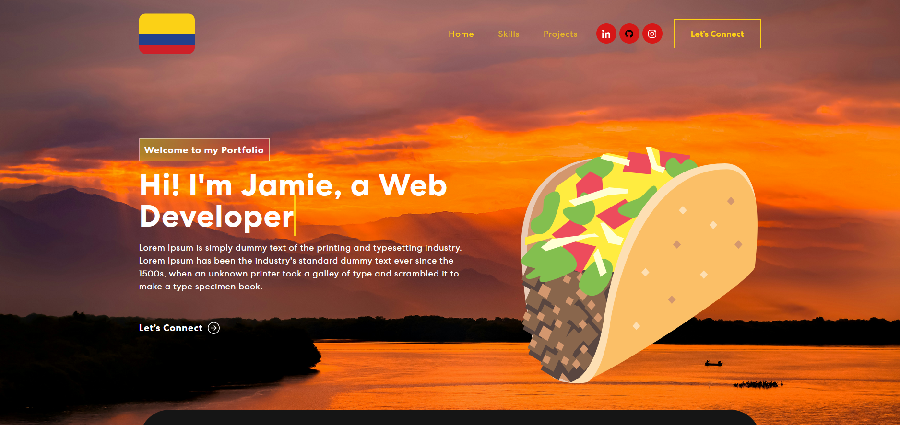

# My Portfolio Website

Welcome to my personal portfolio website! This site is a showcase of my projects, skills, and experiences, as well as a way for you to get in touch with me. 



## Table of Contents
1. [About Me](#about-me)
2. [Projects](#projects)
3. [Contact](#contact)
4. [Technologies Used](#technologies-used)
5. [License](#license)

## About Me
I am Jamie Zhou, a recent graduate with a Bachelor of Science degree from the University of Auckland. I have a strong passion for programming and have experience in Python, JavaScript, C#, Java, and React. This portfolio is a reflection of my journey and the projects I've worked on.

## Projects
The projects section of my portfolio highlights a variety of work I've completed, from academic assignments to personal projects. Each project includes a brief description, the technologies used, and a link to the project's repository or live demo. Here are a few examples:
- **Health Star Calcualtor:** Brief description of the project. [https://www.healthstarcalcnz.online/](#)
- **Travel Website:** Brief description of the project. [https://jzho954.github.io/travel/](#)


Visit [my portfolio](https://jzho954.github.io/portfolio-new/) to explore all of my projects in detail.

## Contact
I would love to hear from you! Whether you have a question about my work, a project collaboration idea, or just want to connect, feel free to reach out. You can contact me through the following methods:
- **Email:** [jamiezhou777@gmail.com](mailto:your.email@example.com)
- **LinkedIn:** [https://www.linkedin.com/in/jamie-zhou-227451221/](#)
- **GitHub:** [My GitHub](https://github.com/jzho954)

## Technologies Used
This portfolio website is built using modern web development technologies, including:
- **HTML5**
- **CSS3**
- **JavaScript**
- **React**
- **BootStrap**

## Running the Project
To run this project locally, you need to have [Node.js](https://nodejs.org/) and [npm](https://www.npmjs.com/) installed on your machine. Follow these steps to get started:

1. Clone the repository:
    ```sh
    git clone https://github.com/jzho954/portfolio-new.git
    ```

2. Navigate to the project directory:
    ```sh
    cd portfolio-new
    ```

3. Install the dependencies:
    ```sh
    npm install
    ```

4. Start the development server:
    ```sh
    npm start
    ```

5. Open your browser and go to `http://localhost:3000` to view the website.

## License
This project is licensed under the MIT License. See the [LICENSE](LICENSE) file for details.
